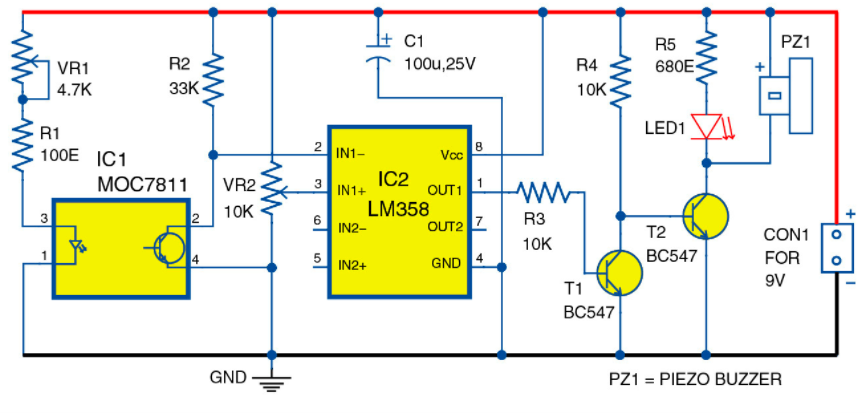

### Optical-Smoke - Detector

Optical smoke detector is a project implemented on the Arduino board works using the light scatter principle.

**An Optical Smoke Detector is a device that senses smoke, typically as an indicator of fire.**

### Components Used
* 10K potentiometer.
* IC MOC7811.
* IC LM358.
* Resistors: 100 ohms, 680 ohms, 33K, 10K and 220 ohms.
* Two transistors BC547A.
* 1 LED.
* 1 electric buzzer.
* 1 Capacitor 100 microfarad, 25 volts.

## Description

those optical smoke detector uses MOC 7811 which is an *optocoupler*. The MOC-7811 will be controlled from the Arduino board. The sensor designed for this device is based on the principle of scattering of *infrared rays*. The light coming from the light source passes through the air being tested and reaches the photosensor. In case of smoke, the received light intensity will be reduced by absorption due to smoke. It can be easily observed while simulating the circuit. The serial monitor will show decreased value whenever smoke will be detected. This change in light intensity again causes change in the resistance and hence results in the voltage drop. As this happens, the transistor T1 (as shown in the schematic) stops working and transistor T2 starts working and starts off the buzzer.

## Schematic of the whole circuit

## Schematic of Optocoupler with Arduino Board
For simulation purpose, here Optocoupler 4N35 has been used instead of IC MOC 7811. Although, working of both the components are same.

## Final Implementation Of The Circuit

## Code for controlling MOC-7811

In this project, only optocoupler i.e. MOC 7811 is being controlled for the Arduino board. Arduino code is available .
